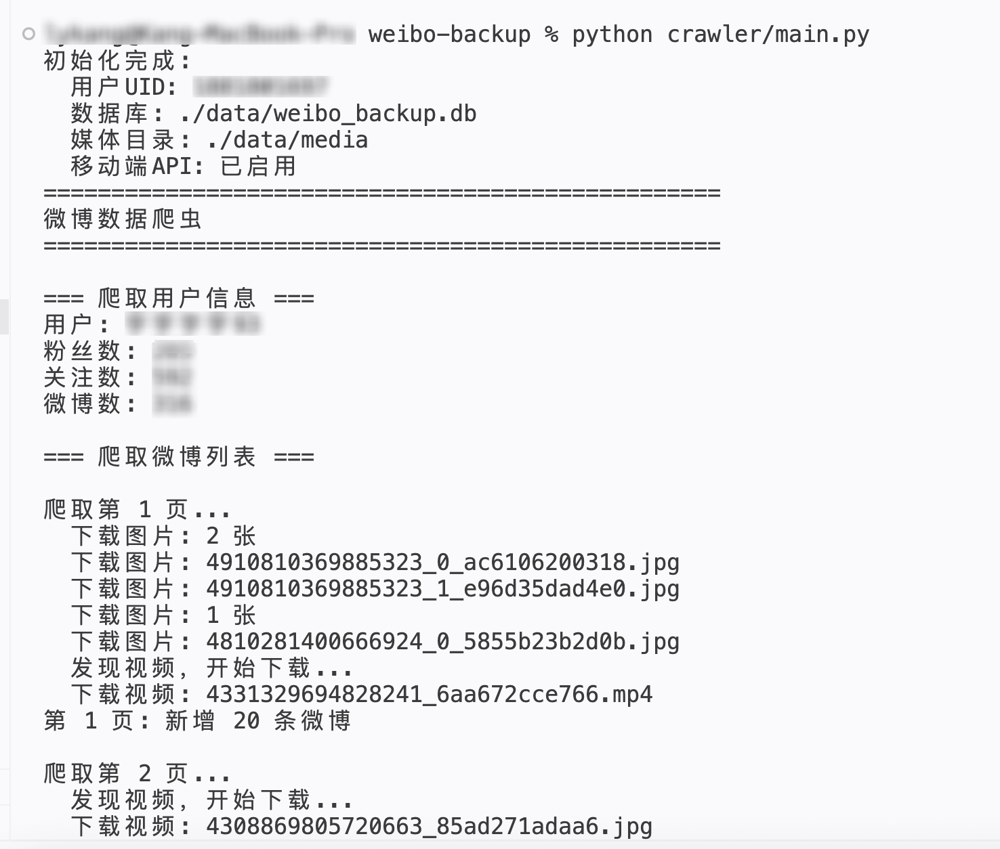
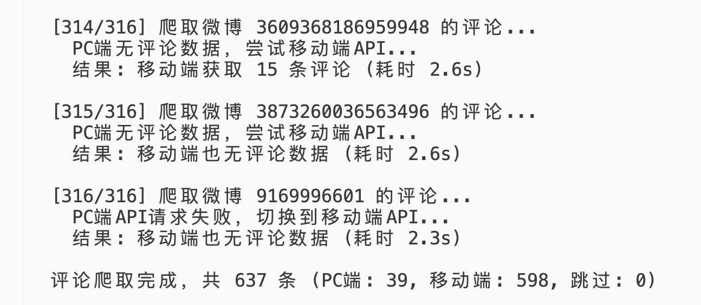
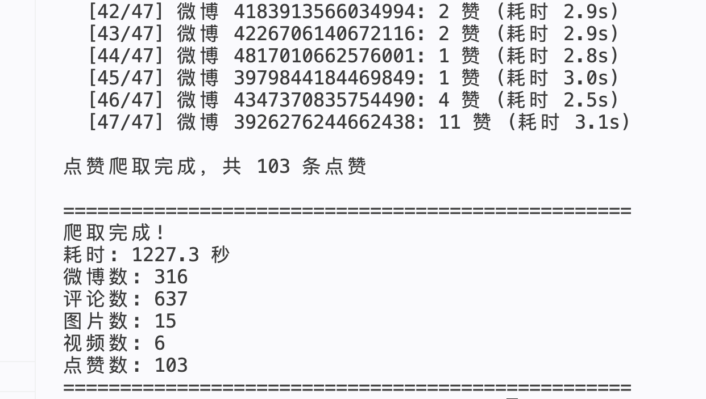

# 微博数据备份系统

将个人的微博数据完整备份到本地，包括微博内容、图片、视频、评论、点赞等。

## 功能特性

- ✅ 爬取全部微博内容
- ✅ 下载图片到本地
- ✅ 提取视频链接
- ✅ 爬取评论和回复（楼中楼）
- ✅ 自动降级移动端API获取历史评论
- ✅ 爬取点赞用户列表（通过移动端API）
- ✅ Vue3 前端可视化展示
- ✅ 关键词搜索
- ✅ 时间线浏览
- ✅ 图片画廊

## 技术栈

- **爬虫**: Python + requests
- **数据库**: SQLite
- **后端**: FastAPI
- **前端**: Vue3 + Vite + Element Plus

## 快速开始

### 1. 安装 Python 依赖

```bash
pip install -r requirements.txt
```

### 2. 配置环境变量

1. 复制环境变量模板：

```bash
cp .env.example .env
cp frontend/.env.example frontend/.env
```

2. 填写必要的配置：
   - 打开 `.env` 文件，填入你的微博 Cookie 和 UID
   - 获取 Cookie 方法：
     1. 打开 Chrome 浏览器，登录 [weibo.com](https://weibo.com)
     2. 按 `F12` 打开开发者工具
     3. 切换到 `Network` 标签
     4. 刷新页面，点击任意请求
     5. 在 `Request Headers` 里找到 `Cookie` 字段，复制整个值
   - **（可选）配置 `WEIBO_GSID`**：用于爬取历史评论和点赞用户列表
     - 手机安装抓包工具（iOS: Stream / Charles, Android: HttpCanary）
     - 打开微博 App，浏览任意页面
     - 在请求 URL 参数中找到 `gsid=` 的值，复制到 `.env` 文件
     - gsid 会和 Cookie 一样过期，过期后重新抓包更新即可

### 3. 运行爬虫

```bash
# 完整爬取（微博 + 评论 + 点赞）
python crawler/main.py

# 只爬取评论（会跳过已有评论的微博）
python crawler/main.py --comments-only

# 只爬取点赞用户（需配置 WEIBO_GSID）
python crawler/main.py --likes-only

# 补全超长博文的完整文本
python crawler/main.py --texts-only

# 限制爬取页数（测试用）
python crawler/main.py --pages 10
```

启动后，控制台输出如下：

**初始化 & 爬取用户信息：**



**爬取评论过程：**



**爬取点赞 & 完成统计：**



**重新爬取所有评论：**
```bash
# 1. 清空评论表
sqlite3 data/weibo_backup.db "DELETE FROM replies; DELETE FROM comments;"

# 2. 重新爬取（会遍历所有微博）
python crawler/main.py --comments-only

# 3. 爬取完成后恢复评论数统计
sqlite3 data/weibo_backup.db "UPDATE posts SET comments_count = (SELECT COUNT(*) FROM comments WHERE comments.post_id = posts.id);"
```

### 4. 启动后端服务

```bash
# 从项目根目录启动
python server/main.py
```

后端服务将在 http://localhost:8000 启动

### 5. 启动前端

```bash
cd frontend
npm install
npm run dev
```

前端将在 http://localhost:5173 启动

### 6. 一键启动（推荐）

```bash
./start.sh
```

## 项目结构

```
weibo-backup/
├── crawler/              # 爬虫模块
│   ├── main.py          # 爬虫主程序（PC端API + 移动端API降级）
│   ├── database.py      # 数据库操作
│   └── downloader.py    # 媒体下载
├── server/              # 后端服务
│   └── main.py          # FastAPI服务
├── frontend/            # 前端项目
│   ├── src/
│   │   ├── views/       # 页面组件
│   │   ├── api/         # API调用
│   │   ├── utils/       # 工具函数（时间格式化、媒体URL等）
│   │   └── router/      # 路由配置
│   └── ...
├── data/                # 数据目录（不提交Git）
│   ├── weibo_backup.db  # SQLite数据库
│   └── media/           # 媒体文件
│       └── images/      # 图片（按年份分类）
├── .env                 # 配置文件（不提交Git）
├── .env.example         # 配置示例
├── requirements.txt     # Python依赖
├── start.sh             # 启动脚本
└── README.md            # 项目说明
```

## 数据库表结构

| 表名 | 说明 |
|------|------|
| users | 用户信息 |
| posts | 微博内容 |
| images | 图片记录 |
| videos | 视频记录 |
| comments | 评论 |
| replies | 评论回复 |
| likes | 点赞记录 |
| crawl_progress | 爬取进度 |

## API 接口

| 接口 | 方法 | 说明 |
|------|------|------|
| /api/user | GET | 获取用户信息 |
| /api/posts | GET | 获取微博列表 |
| /api/posts/{id} | GET | 获取微博详情 |
| /api/search | GET | 搜索微博 |
| /api/timeline | GET | 获取时间线（分页） |
| /api/on_this_day | GET | 历史上的今天 |
| /api/images | GET | 获取图片列表（分页、排序） |

## 注意事项

1. **Cookie 有效期**: Cookie 会过期，爬取中断后需要重新获取
2. **请求频率**: 默认每次请求间隔 2 秒，可在 `.env` 中调整 `REQUEST_DELAY`
3. **反爬机制**: 如果遇到 403/412 错误，停止爬取，等待几小时或更换 Cookie
4. **点赞数据**: 通过移动端API（需配置 `WEIBO_GSID`）爬取点赞用户列表，可使用 `--likes-only` 命令单独运行
5. **数据安全**: Cookie 包含登录凭证，`.env` 和 `data/` 目录不要提交到 Git 仓库
6. **历史评论**: 部分发布较早的微博（如2011年之前的），PC端网页API无法获取评论数据。此时爬虫会自动降级使用移动端API（需要配置 `WEIBO_GSID`）。gsid 会过期，和 Cookie 一样需要定期更新。

## 常见问题

### Q: 爬取中断怎么办？

A: 爬虫支持断点续爬，重新运行即可从上次的位置继续。

### Q: Cookie 过期了怎么办？

A: 重新登录微博，获取新的 Cookie，更新 `.env` 文件。

### Q: 图片/视频没有下载？

A: 检查 `data/media` 目录权限，确保有写入权限。

### Q: 前端页面空白？

A: 确保后端服务已启动，且 CORS 配置正确。

### Q: `--texts-only` 有什么用？

A: 用于补全数据库中已有的超长博文文本。新爬取时超长文本会自动补全，不需要手动执行。

### Q: `WEIBO_GSID` 怎么获取？

A: 在手机上用抓包工具（iOS: Stream / Charles, Android: HttpCanary）打开微博 App，浏览任意页面，在请求 URL 参数中找到 `gsid=` 的值复制到 `.env` 即可。gsid 会过期，和 Cookie 一样需要定期更新。

## License

MIT